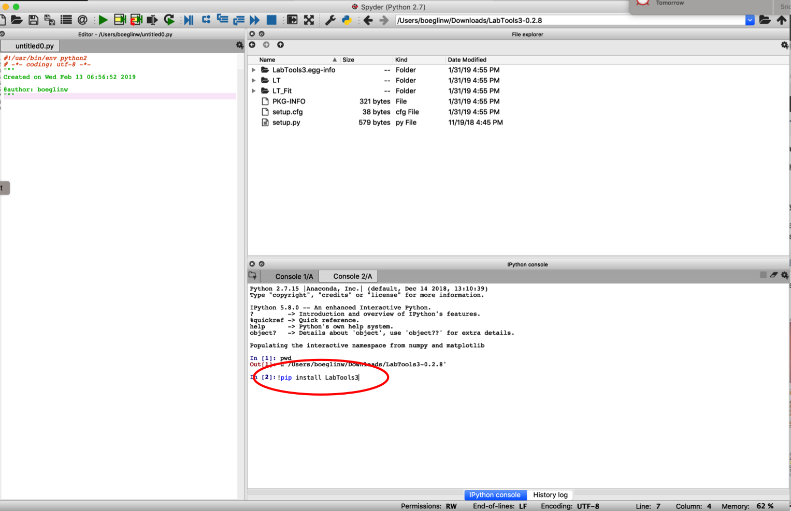

Installation
============

These instructions assume that you have all necessary software `requirements`_ installed and running.

You can download the ``LabTools3`` package from :download:`LabTools3-0.2.9.zip<../../LabTools3/package/dist/LabTools3-0.2.9.zip>` 

**Important:** 

Install ``LabTools3`` only **after** you have installed Anaconda or any
other python distribution you want to use.

After downloading, extract the ``LabTools3`` zip file which most likely resides in your
``Downloads`` folder. In Windows it is important that you really extract the file (select extract all)
and not just look at the contents of the zip file.

Installation using Anaconda
---------------------------

Start **Spyder** and, using the file explorer, go to the directory (or folder) where you extracted the LabTools file.

.. _st_fig1:

   Figure 1: Select directory where you extracted the LabTools

Once you selected the download directory where the LabTools are located as shown in :ref:`Fig. 1<st_fig1>` enter the command
*%run setup.py install* (red ellipse in the figure).
This will install the software. Restart spyder and you are ready to use the ``LabTools3``.

Now you should be ready to do the start the `tutorial`_\ .

.. _tutorial: http://wanda.fiu.edu/boeglinw/LabTools3/doc/python_fundamtentals.html 

.. _requirements: http://wanda.fiu.edu/boeglinw/LabTools3/doc/needs.html

